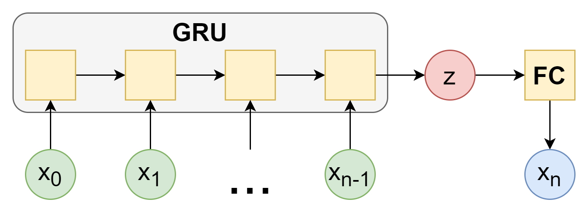
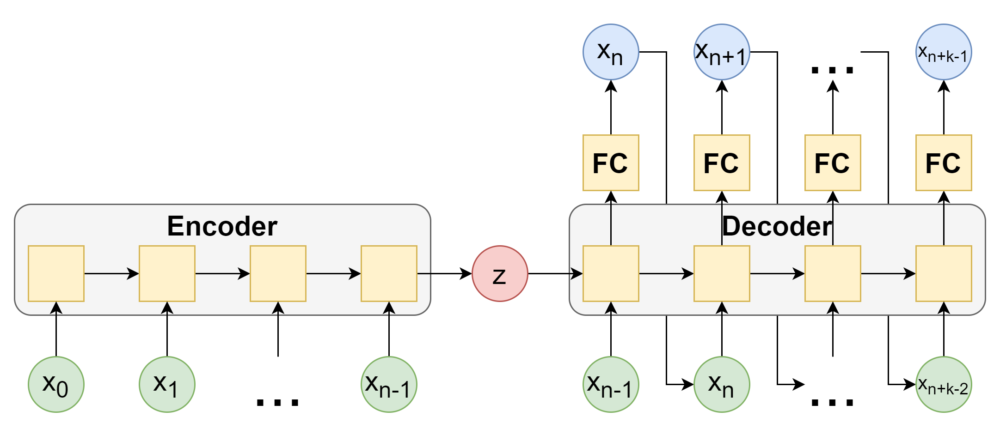
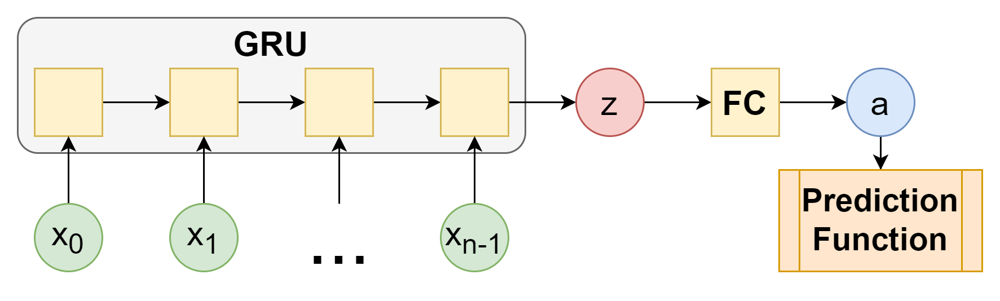

# Prezicerea seriilor temporale folosind deep learning

Tema acestui proiect studierea modurilor in care putem folosi algoritmi deep learning pentru prezicerea seriilor temporale.

## Modele folosite

In cadrul acestui proiect, am implementat 3 modele:

### Modelul Iterative

Modelul este alcatuit din un modul GRU, ce are rolul de a parcurge secventa si de a obtine un tensor ce reprezinta secventa.

Apoi, acesta trece printr-un modul FC(fully connected) ce are rolul de a transforma tensorul in urmatorul element al secventei.

Fie $$x_0,x_1,...,x_{n-1}$$ secventa data, unde _n_ este lungimea secventei date. Pentru a calcula xn, secventa x0, x1, ..., xn-1 este data modulului GRU, iar tensorul rezultat este dat modulului FC pentru a obtine xn.

Pentru a obtine xn+1, repetam procesul pentru secventa x1, x2, ..., xn

Asadar, pentru a obtine o predictie de lungime _m_, trebuie sa aplicam cele 2 module de _m_ ori.

### Modelul Encoder

Modelul este alcatuit din 2 module: Encoder si Decoder.

Encoder contine un modul GRU ce preia secventa de intrare si o transforma in tensorul de context, ce retine starea secventei.

Decoder contine un modul GRU si un modul FC (fully connected). Primul primeste ultimul element al secventei si tensorul de context si intoarce 2 tensori: tensorul de iesire, ce este trecut prin modulul FC pentru a obtine urmatorul element al secventei, si tensorul hidden, ce reprezinta starea ascunsa a modulului GRU.

La urmatoarea iteratie, modulul GRU va primi la intrare elementul obtinut anterior si tensorul hidden.

Pentru a obtine o predictie de lungime _m_, aplicam o data modulul encoder, apoi aplicam modulul encoder de _m_ ori.

#### Teacher Forcing

In plus, pentru cele 2 modele anterioare, am folosit teacher forcing, ce consta in inlocuirea aleatoare in timpul antrenarii a elementului obtinut din prezicere cu elementul din secventa tinta de pe pozitia corespunzatoare. Astfel, se obtine o convergenta mai rapida la antrenare.

### Modelul Fourier

Modelul este alcatuit din un modul GRU, ce are rolul de a parcurge secventa si de a obtine un tensor ce reprezinta secventa.

Apoi, acesta trece printr-un modul FC(fully connected) ce are rolul de a transforma tensorul in parametrii unei ecuatii folosite pentru a prezice urmatoarele valori.

Ecuatia folosita are urmatoarea forma:

$$ F(x) = a_0 + a_1*x + \sum_{i=1}^T(a_{3*i-1} * sin(a_{3i} + a_{3i+1}*x)) $$
unde T reprezinta numarul de termeni sin in suma, iar secventa
$$ a_0,a_1,...,a_T $$
reprezinta parametrii intorsi de model.

Astfel, daca dorim sa prezicem urmatoarele m valori, folosim functia F astfel:
$$ x_{n+i}=F(i) $$

## Compararea performantei

Ca metrica de masurare a acuratetei predictiilor, am folosit functia de cost MSELoss.

Set de date folosit pentru testare:

<https://www.kaggle.com/datasets/robikscube/hourly-energy-consumption>

COMED_hourly.csv

Antrenarea modelelor a fost realizata pe platforma Kaggle, cu accelerator GPU P100.

#### Hyperparametri de baza

|Hyperparameter|Value|
|--------------|------|
|Batch size    |64    |
|Sample len    |24    |
|Target len    |6     |
|Epochs        |100   |
|Train iter    |200   |
|Val iter      |100   |
|HID_DIM       |64    |
|RNN_LAYERS    |4     |
|LIN_LAYERS    |2     |
|DROPOUT       |0.5   |
|N_SIN_TERMS   |16    |

### Test 1

#### Rezultate antrenare

| Model folosit | Timp de antrenare |MSE validare|
|---------------|-------------------|------------|
|   Iterative   |       22:36       |   0.0382   |
|   Encoder     |       04:55       |   0.0327   |
|   Fourier     |       02:21       |   0.0263   |

#### Observatii

Modelul Iterative are un timp de antrenare foarte mare, intrucat necesita parcurgerea intregii secvente pentru fiecare element prezis.

Intrucat modelul Iterative are un timp de antrenare foarte mare si cea mai mare eroare, deci nu il mai folosim in continuare.

### Test 2

#### Hyperparametri

|Hyperparameter|Value |
|--------------|------|
|Sample len    |120   |
|Target len    |24    |

#### Rezultate antrenare

| Model folosit | Timp de antrenare |MSE validare|
|---------------|-------------------|------------|
|   Encoder     |       14:35       |   0.1003   |
|   Fourier     |       03:05       |   0.1134   |

#### Observatii

Modelul Encoder are un timp de antrenare preportional cu dimensiunea secventei prezise, intrucat necesita aplicarea modulului FC pentru fiecare element din secventa, in timp ce modelul Fourier nu are nevoie de acest lucru. Totusi, se observa ca modelul Fourier are o eroare mai mare.

## Detalii de implementare

1. Citirea datelor

Datele sunt citite dintr-un fisier csv intr-un tensor torch, rezultand intr-o singura secventa lunga ce poate avea una sau mai multe trasaturi. In loc sa salvam in memorie fiecare sample folosit pentru antrenare si validare, folosim o functie generator ce creeaza batch-urile de secvente sample si target.
